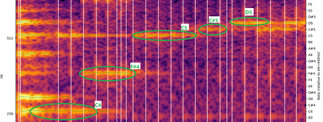

# A4 Analyzer

> This was originally the term project of the _Signal and System_ course of E.E, Tsinghua University in 2019.

This tool that can analyze audio files and estimate the frequecy of A4 (i.e. concert pitch).


## Features

- Draw spectrograms with pitch lines and frequecy & note scales.
- Estimate the frequency of A4 automatically (in silent mode)
- Estimate the frequency of A4 interactively (with selected notes)





## Requirements

- python 3
- colorama

- librosa

- matplotlib

- numpy


## Usage

```
usage: a4_analyzer.py [-h] [-s] [-o OFFSET] [-d DURATION] filename

This tool can analyze audio files and estimate the frequecy of A4.

positional arguments:
  filename

optional arguments:
  -h, --help            show this help message and exit
  -s, --silent          process the given audio file silently
  -o OFFSET, --offset OFFSET
                        the offset of the audio to process, default 0
  -d DURATION, --duration DURATION
                        the duration of the audio to process. It will 
                        process to the end if the argument is not used
```

